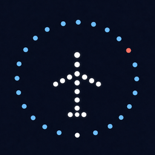
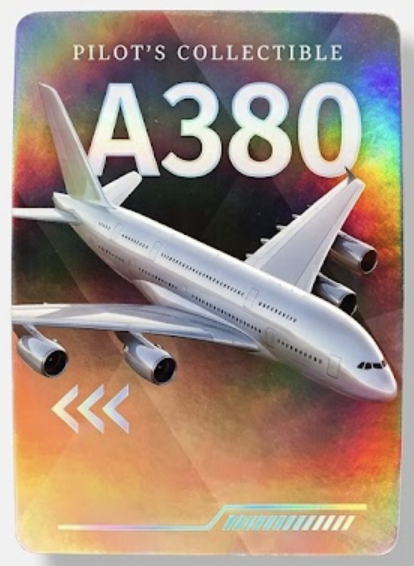
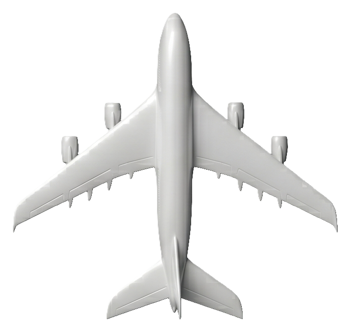

<p align="center">
  
</p>

<h1 align="center">Overhead</h1>

<p align="center">
  <strong>You hear the plane. You look up. Now you know what it is.</strong>
</p>

<p align="center">
  Native iOS · SwiftUI · MapKit · WidgetKit · watchOS
</p>

<p align="center">
  Dark-only flight tracker for the moment a plane passes overhead — live ADS-B on a full-bleed map, airport LED typography, frosted glass, and a camera that identifies the aircraft you’re pointing at.
</p>

---

## Product

Put your captures in `docs/media/screenshots/` using these filenames — this section is already wired to them.

| `map.png` | `quick-card.png` | `camera.png` |
| :---: | :---: | :---: |
|  |  |  |
| Nearby traffic on a dark map | LED callsign + telemetry | Point at the sky to lock a plane |

| `detail.png` | `board.png` | `widget.png` |
| :---: | :---: | :---: |
|  |  |  |
| Specs without losing the map | Departure-board list | Home Screen widget |

Optional extras: `watch.png`, `profile.png`.

**Walkthrough** — save a screen recording as `docs/media/screenshots/demo.mp4`. GitHub plays MP4 inline. A YouTube (or unlisted) link also works; drop it in place of the file embed.


---

## The problem

Flight-tracking sites are built for dispatchers and hobbyists sitting at a desk. Overhead is built for standing outside: one map, the planes near you, and an answer you can read before the sound fades.

Tap a pin for altitude, speed, heading, and phase. Hold for type and registration. Point the camera if you’d rather identify what’s actually in front of you.

---

## Design

The visual language is an airport at night — departure-board LEDs, instrument glass, the map as the sky. No tab bar, no search chrome, no light mode.

<p align="center">
  
</p>

**LED is not a font.** Callsigns, spec labels, the widget, and the Watch are a 5×7 dot matrix drawn in `Canvas` (`LEDLabel`). Lit cells glow; off cells stay at 7% so the grid still reads as hardware.

**Glass, not grey cards.** Panels are `.ultraThinMaterial` + 28% black tint + a 0.5pt white hairline. Corner radii are concentric with the iPhone display: screen radius minus padding, so popups sit inside the hardware squircle instead of floating as a generic sheet.

**Hierarchy of attention**

| Layer | What you get | Why |
| --- | --- | --- |
| Map | Pins only, heading-rotated | The sky stays the focus |
| Quick card | Callsign, airline, ALT / SPD / HDG / phase | Enough to win the “what is that?” argument |
| Detail sheet | Type, registration, airframe specs | One level deeper, 60% detent so the map never disappears |
| Long-press CTA | “See Airplane Details” | Specs are easy to open by accident on a glass card; hold is the gate |

**Palette**

| Token | Hex | Role |
| --- | --- | --- |
| Navy | `#0A0F1A` | Map chrome, brand base |
| LED Blue | `#73B8EB` | Headers, labels, loading |
| Cyan | `#61CCF5` | Altitude / cruise |
| Coral | `#EB4848` | Airline, live, errors |
| Climb | `#61D194` | Takeoff / climb status |

Type is SF Pro only. Telemetry is monospaced. Board rows scale with Dynamic Type (`@ScaledMetric`). Touch targets stay at 44pt.

---

## iOS

Three targets share one flight model: the iPhone app, the **Overhead Board** Home Screen widget, and an Apple Watch LED display. Location is used only to query nearby traffic.

```
ADS-B  (airplanes.live / adsb.lol, raced in parallel)
   │
   ▼
Flight  ── MapKit pins, heading-rotated aircraft art
   │
   ├── Quick card / board / detail   (SwiftUI glass)
   ├── Camera scan                   (AVFoundation + CoreMotion)
   ├── WidgetKit timeline            (overhead://flight/{icao24})
   └── watchOS LED matrix
```

**Live airspace.** Nearby fetch hits two public ADS-B hosts at once and takes the first non-empty result (8s timeout, ~50 km radius). Flight phase (on land, taking off, landing, cruise) is derived from altitude, speed, vertical rate, and the transponder’s on-ground flag — not a canned status string.

**Sky targeting.** Camera scan is a 1 km viewfinder, not ARKit. `CameraLookTracker` reads true-north attitude from CoreMotion and heading from Core Location, projects each ADS-B target into azimuth / elevation, and locks when the plane stays in the frame for 0.7s. Identify writes a collectible card to the local profile.

**Surfaces that stay in character**

- **Widget** — small + medium LED board of the nearest flight; tap opens the app on that aircraft via `overhead://flight/{icao24}`
- **Watch** — 54×52 LED grid, same bitmap font as iPhone
- **Account** — spotted types become foil collectible cards (737 / 777 / A380 families)

**Enrichment is optional.** Route and extra airframe fields come from OpenSky / AeroDataBox when keys are present. Without keys the app still maps live traffic.

Privacy: precise location, app functionality only, not linked, not used for tracking (`PrivacyInfo.xcprivacy`). Camera is used only while the scanner is open.

---

## Collection

Identify a type nearby and it lands in Account as a card.

<p align="center">
  
  
  
</p>

Map pins use a bundled top-down catalog (one silhouette per family — every 737 variant shares `ac_b737`, and so on), rotated to heading.

<p align="center">
  
  &nbsp;&nbsp;
  
</p>

---

## Stack

| | |
| --- | --- |
| UI | SwiftUI, MapKit, SwiftUI `Canvas` LED |
| Camera | AVFoundation preview, CoreMotion attitude, Core Location heading |
| Data | Public ADS-B JSON, optional OpenSky + AeroDataBox |
| Surfaces | WidgetKit (small/medium), watchOS companion, `overhead://` deep links |
| Design | Dark-only, SF Pro, 4pt spacing, concentric radii |

---

## Run it

1. Open `flight-tracker.xcodeproj` in Xcode.
2. Select the **flight-tracker** scheme, iPhone destination.
3. Optional: copy `Config/Secrets.xcconfig.example` → `Config/Secrets.xcconfig` and add AeroDataBox / OpenSky keys. The file is gitignored.
4. Run. Grant location (and camera if you try scan). Simulator: **Features → Location** to a city with traffic, or a custom coordinate.

Widget: run the app once so the timeline has flights, then add **Overhead Board** from the Home Screen widget gallery.

---

## Project

```
flight-tracker/          iPhone app — map, glass cards, camera, profile
FlightTrackerWidget/     Home Screen LED board
FlightTrackerWatch/      watchOS LED display
Config/                  Secrets.xcconfig.example
docs/media/              Icon, cards, and your screenshots
```
